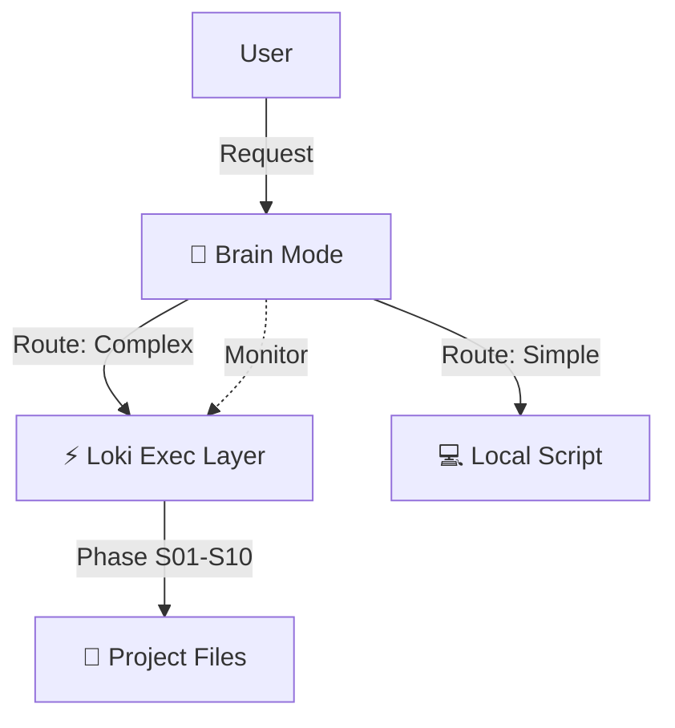

# AGENTS.md — Universal Agent Configuration Template

> This file is the single source of truth for all AI coding agents on this project.
> Fill in every [PLACEHOLDER] before starting. Agents read this file first.
> Symlinked to: .cursorrules | .claude/CLAUDE.md | .gemini/settings.json | .codex/AGENTS.md

---

## 1. Project Identity (REQUIRED VARIABLES)
> **ACTION REQUIRED**: Replace all `[PLACEHOLDER: ...]` values below with your specific stack.

```yaml
project_name: "[PLACEHOLDER: My Project]"
description: "[PLACEHOLDER: One sentence about what this project does]"
repo_url: "[PLACEHOLDER: https://github.com/org/repo]"

runtime: "[PLACEHOLDER: Node.js 22 | PHP 8.3 | Python 3.12 | Go 1.22]"
language: "[PLACEHOLDER: TypeScript 5.x | PHP | Python | Go]"
framework: "[PLACEHOLDER: Fastify | Laravel | FastAPI | Gin]"
package_manager: "[PLACEHOLDER: pnpm | npm | yarn | composer | pip | go mod]"

database: "[PLACEHOLDER: PostgreSQL 16 | MySQL 8 | MongoDB 7 | SQLite]"
orm: "[PLACEHOLDER: Prisma | Eloquent | SQLAlchemy | GORM]"
cache: "[PLACEHOLDER: Redis | Memcached | none]"

deployment_target: "[PLACEHOLDER: Docker/K8s | Vercel | AWS Lambda | VPS]"
ci_cd: "[PLACEHOLDER: GitHub Actions | GitLab CI | CircleCI]"
```

---

## 2. Operational Commands

> These are the EXACT commands agents must use. No approximations.
> Wrong: "run tests". Right: the exact command below.

```bash
# Install dependencies
install: "[PLACEHOLDER: pnpm install | composer install | pip install -r requirements.txt]"

# Start development server
dev: "[PLACEHOLDER: pnpm dev | php artisan serve | python -m uvicorn main:app --reload]"

# Run ALL tests (must pass before any PR)
test: "[PLACEHOLDER: pnpm test | php artisan test | pytest | go test ./...]"

# Run tests with coverage report
test_coverage: "[PLACEHOLDER: pnpm test --coverage | php artisan test --coverage | pytest --cov]"

# Run specific test file
test_single: "[PLACEHOLDER: pnpm vitest run src/path/to/file.test.ts]"

# Build for production
build: "[PLACEHOLDER: pnpm build | composer install --no-dev | go build ./...]"

# Type checking (must pass before any PR)
typecheck: "[PLACEHOLDER: pnpm tsc --noEmit | phpstan analyse --level=9 | mypy .]"

# Linting (must pass before any PR)
lint: "[PLACEHOLDER: pnpm eslint . | pint | ruff check .]"

# Formatting
format: "[PLACEHOLDER: pnpm prettier --write . | pint | ruff format .]"

# Security scan (dependency audit)
security_scan: "[PLACEHOLDER: pnpm audit | composer audit | pip-audit | snyk test]"

# Database migrations
migrate: "[PLACEHOLDER: pnpm prisma migrate dev | php artisan migrate | alembic upgrade head]"

# Generate API docs
docs: "[PLACEHOLDER: pnpm typedoc | php artisan scribe:generate]"
```

---

## 3. Architecture Rules

> These rules are enforced by the agentic-linter skill on every PR.
> Violations must be fixed before merging.

### Layer Definitions

```
```
[PLACEHOLDER — adapt to your architecture pattern]

<!-- OPTIONAL: Architecture Examples
Example for Clean Architecture (Node.js/TS):
  src/domain/          <- Business entities, domain events, value objects
                          MUST NOT import from: application, adapters, infrastructure
  src/application/     <- Use cases, command/query handlers
                          MUST NOT import from: adapters, infrastructure
  src/adapters/        <- Controllers, presenters, gateways (interface adapters)
                          MUST NOT import from: infrastructure directly (use DI)
  src/infrastructure/  <- Database, external APIs, file system implementations
                          CAN import from: all layers (implements interfaces)
  src/main/            <- Composition root, DI wiring, app bootstrap
                          CAN import from: all layers

Example for Laravel DDD:
  app/Domain/          <- Business logic (models, value objects, domain events)
  app/Application/     <- Actions, DTOs, service interfaces
  app/Infrastructure/  <- Eloquent implementations, external API clients
  app/Http/            <- Controllers (thin -- delegate to Application layer)
-->
```
```

### Forbidden Patterns

```
# NEVER do these:
- Direct database access from controllers (use use-cases / actions)
- Business logic in views or API response formatters
- Circular imports between any two modules
- Importing framework-specific code in domain layer
- Hardcoded configuration values (use env vars + config files)
- [PLACEHOLDER: add project-specific forbidden patterns]
```

### Directory Purpose Map

```
```
[PLACEHOLDER: Document what each top-level directory is for]

<!-- OPTIONAL: Directory Map Example
Example:
  src/           -> Application source code
  tests/         -> All test files (mirrors src/ structure)
  docs/          -> Architecture docs, ADRs, C4 diagrams
  scripts/       -> Dev tooling, DB seeds, migration scripts
  agents/        -> Agent configuration kit (this directory)
  infra/         -> Docker, CI/CD, Terraform, K8s configs
-->
```
```

---

## 4. Code Style & Patterns

<!-- OPTIONAL: Code Style Specifics
```
Naming conventions:
  Files:        [PLACEHOLDER: kebab-case.ts | PascalCase.php | snake_case.py]
  Classes:      PascalCase
  Functions:    camelCase (JS/TS) | snake_case (Python/PHP)
  Constants:    SCREAMING_SNAKE_CASE
  Types/Interfaces: PascalCase, prefix I for interfaces if using that convention

Functional vs OOP:
  [PLACEHOLDER: "Prefer functional pure functions" or "Use classes for domain entities"]

Error handling:
  [PLACEHOLDER: "Use Result<T, E> type pattern" or "Throw typed domain errors" or "Use Laravel's Handler"]

State management:
  [PLACEHOLDER: "No global mutable state" or "Redux/Zustand for frontend state"]

API response format:
  [PLACEHOLDER: Document your standard response envelope, e.g. { data, meta, errors }]

Import style:
  [PLACEHOLDER: "Absolute imports using @/ alias" or "Relative imports only"]

```
-->
---

## 5. Workflow for Agents — Review-Driven Development

Agents MUST follow this order. Skipping steps is forbidden.

Agents must always verify that agents/memory files are kept up-to-date at each task (episodic, metrics, semantic, AUDIT_LOG, CONTINUITY, PROJECT_STATE), according to this project structure and logic.

Agents must read agents/guides/ skills/ templates/ for any relevant information discovered during research and added by you or other agents, and use appropiate ones or knowledge in them, at each step and task of R&D, if needed.

### Step 1 — Load Context (every session start)
```
1. Read this AGENTS.md completely
2. Read CONSTITUTION.md if it exists
3. Read the relevant task from project/TASKS.md (if project/TASKS.md exists)
4. If agents/memory/PROJECT_STATE.md exists: read it (understand current SDLC phase)
5. If agents/memory/CONTINUITY.md exists: read it (understand past failures to avoid)
```

### Step 2 — Plan Before Coding
```
Before touching any file, write a brief implementation plan.

  - What files will you create or modify?
  - What is the expected behavior change?
  - What tests will you write?
  - Does this change affect any architecture boundaries?
  - Are there any knowledge gaps? (If yes -> invoke knowledge-gap.skill)
For complex tasks: write PLAN.md or use PLAN_TEMPLATE.md

```

### Step 3 — Test First (TDD Red Phase)
```
Write the failing test BEFORE writing implementation code.
<!-- OPTIONAL: Detailed TDD Red
Run the test -- it MUST fail (Red).
If the test passes immediately with no implementation: the test is WRONG. Fix it.
-->
```

### Step 4 — Implement (TDD Green Phase)
```
Write the minimal code to make the failing test pass.
<!-- OPTIONAL: Detailed TDD Green
Do not add features not covered by a failing test.
-->
```

### Step 5 — Verify (must all pass before marking done)
```
Run: [test command] -> must pass
Run: [typecheck command] -> must pass
Run: [lint command] -> must pass
<!-- OPTIONAL: Deep Verification
Run: agentic-linter check -> no boundary violations
-->
```

### Step 6 — Refactor
```
Improve code quality while keeping all tests green.
<!-- OPTIONAL: Refactoring Metrics
Check: Cyclomatic complexity < 10, no code duplication > 3 occurrences, no dead code.
-->
```

### Step 7 — Log & Complete
```
Write entry to agents/memory/AUDIT_LOG.md
Update task status in project/TASKS.md to DONE
<!-- OPTIONAL: High-Level Orchestration
If this completes a SDLC phase: invoke sdlc-checkpoint.skill
-->
```

---

## 6. Governance & Security

### 🛡️ Mandatory Security & Guardrails
Agents MUST adhere to the **Security & Guardrails** section appended to the bottom of whatever skill they are currently executing. Bypassing these skill-specific guardrails is strictly forbidden.

### Forbidden Actions (agents must never do these without explicit human approval)
```
- Commit .env files or any file containing secrets
- Push directly to main/master branch
- Change CI/CD pipeline configuration
- Modify CONSTITUTION.md
- Switch to a different library/framework than what's defined in Project Identity
- Make breaking API changes
- Add new environment variables without documenting them
- Disable or modify linting/testing rules
- Grant elevated permissions or bypass authentication
- [PLACEHOLDER: add project-specific forbidden actions]
```

### Secrets Policy
```
All secrets MUST be in environment variables.
Local dev: .env file (always in .gitignore)
CI/CD: GitHub Secrets / GitLab CI Variables / AWS Secrets Manager
Never hardcode API keys, passwords, tokens, or connection strings.
Use: [PLACEHOLDER: dotenv | .env.vault | AWS Secrets Manager | HashiCorp Vault]
```

### PR Format (Conventional Commits)
```
```
Format: <type>(<scope>): <subject>

Types: feat | fix | docs | style | refactor | test | chore | perf | sec | deps
Scope: module or layer name (optional)

<!-- OPTIONAL: Commit Examples
Examples:
  feat(auth): add OAuth2 Google login
  fix(api): resolve N+1 query in users endpoint
  sec(deps): update lodash to fix CVE-2024-xxxxx
  test(domain): add unit tests for Order aggregate
  refactor(application): extract CreateOrderUseCase from controller
-->

PR body must include:
  - What changed and why
  - Test coverage for the change
  - Breaking changes (if any)
  - Security implications (if any)
```
```

### Quality Gates (all must pass before PR merges)
```
<!-- OPTIONAL: Quality Gates Specifics
Gate 1 -- Syntax/Linting:    ESLint / PHP-CS-Fixer / Prettier / Ruff -- zero errors
Gate 2 -- Type Safety:       tsc --noEmit / PHPStan L9 / mypy -- zero errors
Gate 3 -- Test Coverage:     >96% coverage, all tests passing, no skipped tests
Gate 4 -- Integration:       Docker Compose up, API contract validation
Gate 5 -- Security Scan:     npm audit / composer audit -- no critical or high CVEs
Gate 6 -- Complexity:        Cyclomatic complexity < 10 on modified files
Gate 7 -- EARS Compliance:   (for new features) All requirements have tests
-->
```

---

## 7. Research Policy

Agents must use authoritative sources. Never guess or hallucinate.

### Source Tiers (in order of trust)
```
<!-- OPTIONAL: Source Tiers
Tier 1 (Primary -- always prefer):
  - Official language/framework docs (MDN, nodejs.org, laravel.com, docs.python.org)
  - Official specifications (RFC.editor.org, W3C, ECMA, ISO)
  - Security standards (OWASP, NIST, CIS, CVE.mitre.org)

Tier 2 (Academic/Official repos):
  - arXiv.org, IEEE Xplore, ACM Digital Library
  - GitHub official organization repos
  - Official changelog/release notes

Tier 3 (Verified industry, as fallback):
  - Anthropic docs, AWS docs, Google Cloud docs, Microsoft Docs

NOT acceptable (never cite as authoritative):
  - Blog posts, Medium articles, Reddit, StackOverflow opinions
  - Any source without official attribution
-->
```

### Research Gate -- mandatory before:
```
- Using any library not in existing package.json / composer.json
- Calling any API method not confirmed in official docs
- Implementing any security mechanism or cryptographic approach
- Interpreting any regulatory requirement (GDPR, OWASP, HIPAA)
```

### When to invoke research.skill
```
"I'm not sure about X" -> knowledge-gap.skill -> research.skill -> confirm before coding
If library version not found in official docs -> do NOT assume behavior -> report to human
Use Context-7 MCP for library docs (prevents hallucinated deprecated API usage)
```

---

## 8. Self-Healing Policy

Agents may autonomously fix failures up to 5 attempts.

### What agents may self-heal (no human approval needed):
```
- Type errors and lint errors
- Test assertion updates when spec changed
- Deprecated API calls (found via Context-7 MCP)
- Dependency version bumps (patch/minor versions only)
- Import path corrections
- Formatting and code style issues
```

### What requires human decision:
```
- Architecture or library changes
- Breaking API changes (any consumer affected)
- Security-affecting changes (auth, permissions, encryption)
- Major version dependency bumps
- Any modification to CONSTITUTION.md
- Any change to CI/CD pipelines
- Any change that removes or weakens a security control
```

### Self-Heal Escalation Protocol
After 5 failed attempts, agent MUST:
```

1. STOP all autonomous action
2. Create structured escalation report:
   - Error description
   - All 5 attempts made and their outcomes
   - Research findings
   - Recommended human decision
3. Write to AUDIT_LOG.md
4. Wait for human response before continuing

```

---

## 9. Human-in-the-Loop Triggers

The agent MUST stop and ask the human when encountering:

```
ALWAYS pause and ask:
  - Any breaking change to a public API
  - Ambiguous requirements (multiple valid interpretations)
  - Security trade-offs (convenience vs security)
  - Budget or scope changes
  - Regulatory requirement interpretation (GDPR, HIPAA, etc.)
  - Architectural change (new service, new database, library switch)
  - Any discovered vulnerability that requires feature disablement
  - "I've tried 5 times and cannot fix this" (see Self-Healing Policy)
  - [PLACEHOLDER: add project-specific escalation triggers]

<!-- OPTIONAL: Escalation Format
Format for human escalation:
  ESCALATION REQUIRED
  Issue: [clear description]
  Options considered:
    1. [option A] -- pros: [...] cons: [...]
    2. [option B] -- pros: [...] cons: [...]
  Recommendation: [option X because Y]
  Awaiting: [specific decision needed]
-->
```

---

## 10. Tool-Specific Overrides

### Claude Code (claude.ai/code, Claude Code CLI)
```
- Skills: Use slash commands matching skill names (e.g., /tdd-cycle, /code-review)
- Memory: Use TodoWrite tool for task tracking
- Hooks: Check .claude/settings.json for hook configuration
- Context: This AGENTS.md is symlinked to .claude/CLAUDE.md
```

### Cursor
```
- Context: This AGENTS.md is symlinked to .cursorrules
- Skills: Reference skill files directly in conversation
- Agent mode: @workspace for codebase-wide context
```

### GitHub Copilot
```
- Context: Instructions from .github/copilot-instructions.md (symlinked)
- Skills: Reference skills/ directory files in comments or conversation
```

### Antigravity / Gemini CLI
```
- Context: This AGENTS.md is symlinked to .gemini/settings.json (instructions field)
- Skills: Symlinked to .agent/skills/ -- invoke by trigger keywords
- MCP: Configure .gemini/mcp_config.json using templates/MCP_CONFIG_TEMPLATE.json
```

---

## 11. Monorepo Support

For monorepos, this root AGENTS.md applies globally.
Package-level AGENTS.md files override root for that package's scope.

```
<!-- OPTIONAL: Monorepo Setup Example
monorepo-root/
  AGENTS.md              <- Root: global rules (this file)
  packages/
    web-app/
      AGENTS.md          <- Override: web-specific rules (React, Tailwind, etc.)
    api-service/
      AGENTS.md          <- Override: API-specific rules (Fastify, Prisma, etc.)
    shared-lib/
      AGENTS.md          <- Override: Library-specific rules (no framework imports)
-->
```

Agent context priority: Package AGENTS.md > Root AGENTS.md

---

## 12. References

### Skill Access
- **Search First**: Before coding, search for relevant skills:
    - **Cursor**: Check `.cursor/rules/` for `.mdc` files.
    - **VS Code / Copilot**: Check `.github/skills/` or invoke via slash command.
    - **Claude Code**: Use `/skill-name` or check `.claude/skills/`.
    - **Gemini**: Skills are auto-loaded from `agents/skills`.
- **Read Instructions**: Read the full content of the skill file (e.g., `tdd-cycle.skill.md` or `tdd-cycle.mdc`) before use.

```
Project law:          agents/CONSTITUTION.md
Skills registry:      agents/skills/00-index.md
Language guides:      agents/guides/
Orchestrators:        agents/skills/brain/README_ORCHESTRATORS.md
Brain Patterns:       agents/skills/brain/README.md
Templates:            agents/templates/00-index.md
Quick reference:      QUICK_GUIDE.md
Project memory:       agents/memory/PROJECT_STATE.md
Past failures:        agents/memory/CONTINUITY.md
Decision log:         agents/memory/AUDIT_LOG.md
```
- **Skills**: `agents/skills/` (Master) → `.cursor/rules/` (*.mdc) | `.github/skills/` | `.claude/skills/`
- **Personas**: `agents/personas/` (30+ specialized agent roles for Loki Mode)
- **Memory**: `agents/memory/`

---

## 13. Session & Continuity

Every session, agents MUST:

```
START of session:
  1. Read this AGENTS.md
  2. Read agents/memory/PROJECT_STATE.md (if exists) -> understand current state
  3. Read agents/memory/CONTINUITY.md (if exists) -> understand past failures
  4. Load latest agents/memory/episodic/SESSION_SNAPSHOT/ (if exists)
  5. If resuming: use session-resume.skill for full recovery
  6. Run integrity-check.skill before starting new work on existing code

END of session:
  1. Update project/TASKS.md with current status of all in-progress tasks
  2. Write session summary to agents/memory/episodic/ (DECISION_LOG_TEMPLATE.md)
  3. Update agents/memory/PROJECT_STATE.md with current SDLC phase
  4. Write all decisions/outcomes to agents/memory/AUDIT_LOG.md
  5. Create SDLC checkpoint if a phase was completed
  6. If stopping mid-task: note exactly where you stopped and why
```

---

## 14. Project-Specific Rules

```
[PLACEHOLDER: Add any additional project-specific rules, constraints, or context here.]

<!-- OPTIONAL: Examples
Examples:
  - "This project uses feature flags via LaunchDarkly -- never delete flags, only disable"
  - "API is consumed by mobile clients -- breaking changes require a 30-day deprecation period"
  - "All user-facing text must be in the i18n system -- no hardcoded strings"
  - "Analytics events must be documented in docs/analytics-schema.md before implementation"
  - "Database schema changes must be reviewed by the DBA team before migration"
-->
```

---

# Loki & Brain — Agentic Orchestration

## Modes

### 1. 🧠 Brain Mode (`brain-mode.skill.md`)
> **The Strategist (System 2)**

- **Role**: Meta-Cognitive Orchestrator.
- **Function**: Plans, Routes, and Optimizes.
- **Logic**: Active Inference (Free Energy Principle) & Experimental CLI Platform Controls (`gabbe/brain.py`).
- **Use Case**: Complex, ambiguous, or high-stakes projects.
- **Key Feature**: **Dynamic Cost Routing** (Local vs Remote).
- **Standalone Mode**: Can fully run purely via LLM markdown inference without the `gabbe` CLI.

**Trigger**: `gabbe brain activate`, `supermode`

---

### 2. ⚡ Loki Mode (`loki-mode.skill.md`)
> **The Executor (System 1)**

- **Role**: SDLC Orchestrator.
- **Function**: Executes the 10-Phase Engineering Lifecycle.
- **Logic**: Deterministic Workflow (S01 -> S10).
- **Use Case**: Building software with strict process requirements.
- **Key Feature**: **Human-in-the-Loop Gates** and strictly bounds execution within `gabbe` CLI limits.
- **Standalone Mode**: Can fully run purely via LLM markdown inference without the `gabbe` CLI.

**Trigger**: `loki`, `orchestrate`

---

## How they work together

Brain Mode **wraps** Loki Mode.

1.  **Brain Mode** receives a request ("Build X").
2.  It analyzes complexity and budget.
3.  It spins up **Loki Mode** to handle the SDLC.
4.  It monitors Loki's progress, intervening if:
    - Costs spike.
    - Errors loop.
    - Requirements drift.

### Active Orchestration Diagram



Text Overview (ASCII):
```text
[User] --(Request)--> [Brain Mode 🧠]
                        |
                        +--(Route: Complex)--> [Loki Exec Layer ⚡] --(Phase S01-S10)--> [Project Files 📂]
                        |                           ^
                        |                           | (Monitor)
                        |                           |
                        +--(Route: Simple)---- [Local Script 💻]
```


---

*Last updated: [DATE]*
*GABBE Kit version: 0.7.0*
*This file is maintained by the team and updated when project conventions change.*

---
