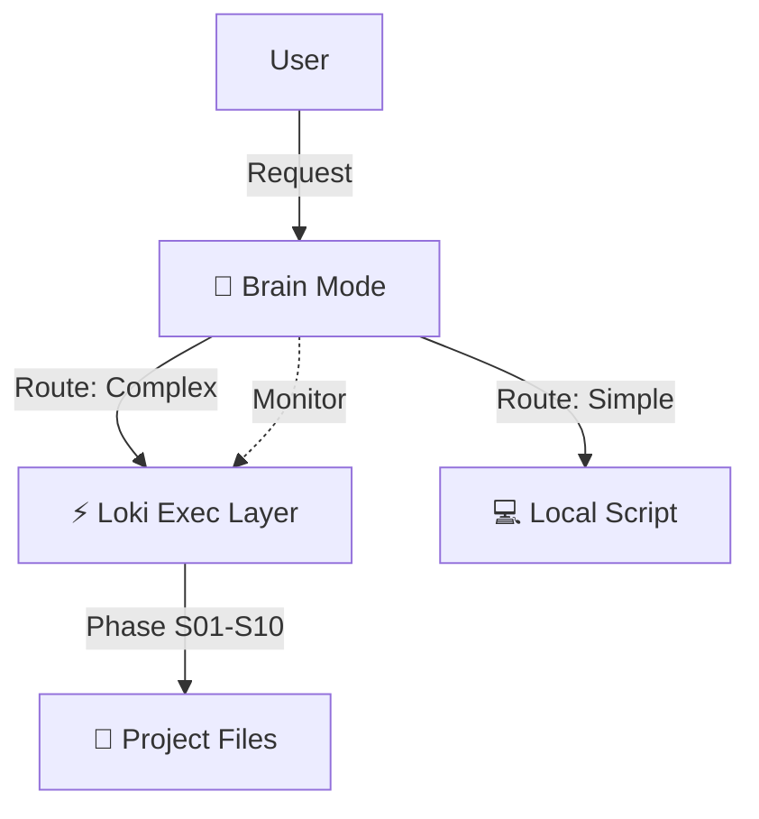

# Loki & Brain — Agentic Orchestration

This directory contains the **High-Level Orchestrators** for the Agentic Engineering Kit.

## Modes

### 1. 🧠 Brain Mode (`brain-mode.skill.md`)
> **The Strategist (System 2)**

- **Role**: Meta-Cognitive Orchestrator.
- **Function**: Plans, Routes, and Optimizes.
- **Logic**: Active Inference (Free Energy Principle).
- **Use Case**: Complex, ambiguous, or high-stakes projects.
- **Key Feature**: **Dynamic Cost Routing** (Local vs Remote).

**Trigger**: `brain activate`, `supermode`

---

### 2. ⚡ Loki Mode (`loki-mode.skill.md`)
> **The Executor (System 1)**

- **Role**: SDLC Orchestrator.
- **Function**: Executes the 10-Phase Engineering Lifecycle.
- **Logic**: Deterministic Workflow (S01 -> S10).
- **Use Case**: Building software with strict process requirements.
- **Key Feature**: **Human-in-the-Loop Gates**.

**Trigger**: `loki`, `orchestrate`

---

## How they work together

Brain Mode **wraps** Loki Mode.

1.  **Brain Mode** receives a request ("Build X").
2.  It analyzes complexity and budget.
3.  It spins up **Loki Mode** to handle the SDLC.
4.  It monitors Loki's progress, intervening if:
    - Costs spike.
    - Errors loop.
    - Requirements drift.



```text
[User] --(Request)--> [Brain Mode 🧠]
                        |
                        +--(Route: Complex)--> [Loki Exec Layer ⚡] --(Phase S01-S10)--> [Project Files 📂]
                        |                           ^
                        |                           | (Monitor)
                        |                           |
                        +--(Route: Simple)---- [Local Script 💻]
```

---

## CLI Reference

In addition to Agent slash commands, you can orchestrate these modes via the GABBE CLI:

| Mode | CLI Command | Purpose |
|---|---|---|
| **Brain** | `gabbe brain` | Activates Active Inference and Cost Routing. |
| **Loki** | `gabbe status` | Visualizes swarm progress and SDLC phase. |
| **Sync** | `gabbe sync` | Ensures Markdown memory and SQLite stays in sync. |
| **Verify** | `gabbe verify` | Runs the automated gate checks for the current phase. |
