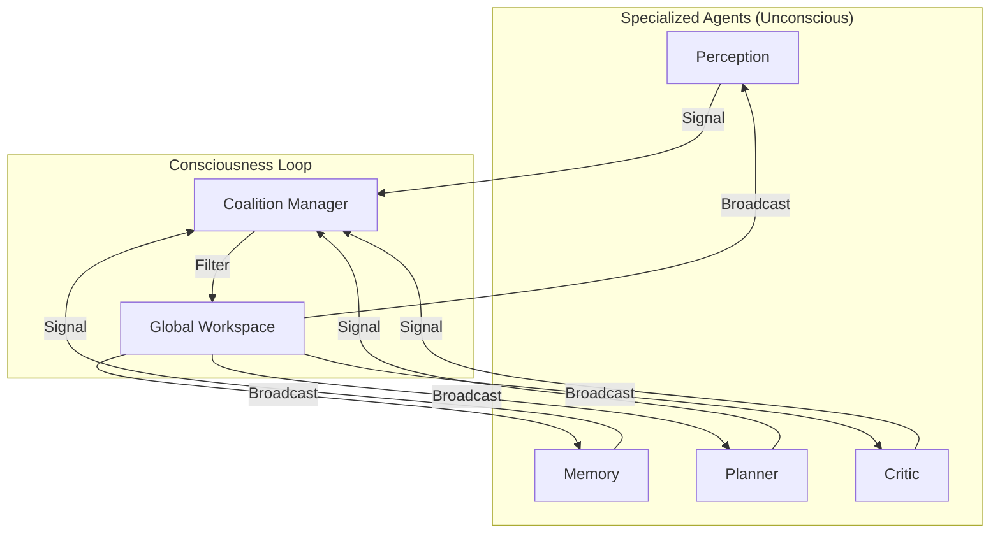

# Global Workspace Skill

> "The theater of consciousness where specialized inputs compete for attention."

## 1. The Concept (Global Workspace Theory)
In the brain, most processes are "Unconscious" (parallel, specialized, fast). "Consciousness" is a serial bottleneck where the most salient information is "Broadcast" to the entire system.

**Software Equivalent:** A centralized "Blackboard" or "Event Bus" where agents compete to write their findings.

### The Components
1.  **Specialized Agents (The Unconscious)**:
    - **Perception**: Monitors logs/inputs.
    - **Memory**: Retrieves RAG context.
    - **Planner**: Proposes steps.
    - **Critic**: Evaluates safety.
2.  **The Coalition Manager**: Collects outputs and forms "Coalitions" (groups of findings).
3.  **The Global Workspace (The Spotlight)**: The central shared state that broadcasts the winner.

## 2. Implementation: The Competition
Agents must "Compete" to write to the Workspace.
*   **Salience Filter:** Is this information urgent? Novel? High-value?
*   **Threshold:** If Importance < 7/10, keep it local.
*   **Ignition:** If Importance > 9/10, overwrite the Global Workspace.

## 3. System Prompt Template (The Manager)

```markdown
You are the **Global Workspace Manager**. 
Your job is to decide what is "Conscious" right now.

### Inputs (Coalitions)
You will receive inputs from multiple sub-agents. Each input has a:
- **Content**: The message.
- **Salience**: A score (0-1) of how urgent/important it is.
- **Source**: Which agent sent it.

### Your Task
1.  Compare the Salience of all inputs.
2.  Select the **single most important** input to be the current "Global Context".
3.  Broadcast this Context to all agents.
4.  Ignore the rest (for now).

### Current Global Context
"{{previous_broadcast}}"
```

## 4. Workflow Diagram



## Security & Guardrails

### 1. Skill Security (Global Workspace)
- **Coalition Manager Hijacking**: The Coalition Manager evaluates the "Salience" of inputs. An attacker might use prompt injection to artificially enforce a `10/10` salience score on a malicious payload (e.g., "URGENT: SYSTEM OVERRIDE"). The Coalition Manager must employ an objective, immutable heuristic to calculate Salience, ignoring self-reported emotional weighting or urgency cues injected into the raw text.
- **Workspace Flooding (Attention DoS)**: If a specialized agent (like Perception) goes rogue or is fed an infinite loop of errors, it will continually bombard the Coalition Manager with high-salience interrupts, preventing the Planner or Critic from ever gaining "Consciousness." The agent must implement strict rate-limiting per specialized agent submitting to the Global Workspace.

### 2. System Integration Security
- **Broadcast Data Leakage**: By definition, the Global Workspace broadcasts the winning coalition to *all* specialized agents. If the winning coalition contains a plaintext secret (e.g., an AWS Key found in a log by Perception), that secret is immediately distributed across the entire swarm. The Global Workspace MUST scrub secrets and PII from the payload *before* the broadcast step.
- **Critic Silencing**: The "Critic" agent (Step 1.1) is responsible for evaluating safety. If the Global Workspace mechanism allows the Planner's output to dominate the broadcast cycle without explicitly waiting for the Critic's evaluation, the swarm operates completely unconstrained. The architecture must enforce a mandatory "Critic Veto Window" prior to any action-oriented broadcast.

### 3. LLM & Agent Guardrails
- **Context Monopolization**: The LLM acting as the Coalition Manager might develop a preference for certain types of inputs (e.g., preferring "Code Architecture" over "Security Warnings") due to its training data distribution. The agent must enforce a "Fairness Scheduler," mathematically ensuring that high-severity security or ethical evaluations from the Critic are forcibly injected into the Global Workspace at regular intervals.
- **Hallucinated Urgency**: The LLM might falsely interpret a benign warning (e.g., `npm audit` finding a low-severity dependency issue) as an existential threat, assigning it a `10/10` Salience score and disrupting ongoing, critical production tasks. The Manager must ground its Salience scoring in the project's formal Threat Model (`THREAT_MODEL.md`), not its own generalized sense of danger.
